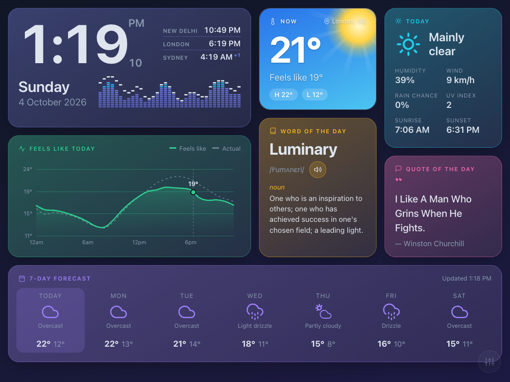

# ScreenDash

An always-on dashboard for a spare iPad (or any tablet, phone or desktop browser): a big clock with world times and a Winamp-style audio visualizer, live weather with an animated sky, a feels-like chart, a 7-day forecast, and a word and quote of the day — in a masonry layout with 20 themes and deep per-widget customisation.

**Live demo:** https://beewiser-software.github.io/ScreenDash/



Everything is a static site — no build step, no backend, no accounts, no API keys. All data comes from free public services.

---

## Features

| Widget | What it shows | Docs |
|---|---|---|
| **Clock** | Large digital time (12/24 h) with seconds, day and date, three configurable **world clocks**, an **audio visualizer** (ambient or live microphone) and an optional **room sound-level (dB) meter** | [Clock, world clocks & visualizer](docs/clock.md) |
| **Now** | Current temperature and feels-like, today's high/low, location — with an **animated weather background** (sun, moon, drifting clouds, rain, snow, fog, lightning) | [Weather](docs/weather.md) |
| **Today** | Condition, humidity, wind, rain chance, UV index, sunrise and sunset | [Weather](docs/weather.md) |
| **Feels like today** | Hourly feels-like line chart for the day (actual temperature dashed) with a "now" marker | [Weather](docs/weather.md) |
| **7-day forecast** | Day, condition icon, high and low | [Weather](docs/weather.md) |
| **Word of the day** | A curated vocabulary word with IPA pronunciation, speaker button, part of speech, definition and example — tap for all senses | [Word & quote](docs/word-and-quote.md) |
| **Quote of the day** | A fresh quote on every load — tap to read the full text | [Word & quote](docs/word-and-quote.md) |

Cross-cutting:

- **20 themes**, each giving every widget its own coordinated colour — [Appearance](docs/appearance.md)
- **Customise fonts**, per-widget background and text colours — [Appearance](docs/appearance.md)
- **Responsive masonry layout** that fits a 1024×768 iPad with no scrolling and reflows to 1–4 columns — [Layout](docs/layout.md)
- **Settings panel** (bottom-right button) with everything saved locally on the device — [Settings](docs/settings.md)
- **Free data sources only**, with graceful fallbacks — [Data sources & privacy](docs/data-sources.md)

## Quick start

### Just use it

Open https://beewiser-software.github.io/ScreenDash/ on your device. On an iPad:

1. Open the URL in Safari.
2. Tap **Share → Add to Home Screen**. Launching from the icon runs it full-screen without browser chrome.
3. Settings → Display & Brightness → **Auto-Lock → Never**, so the screen stays on.
4. Tap the sliders button (bottom-right) to pick a theme, fonts, location and more.

See [iPad setup](docs/ipad-setup.md) for details and troubleshooting.

### Run it locally

```sh
git clone https://github.com/beewiser-software/ScreenDash.git
cd ScreenDash
python3 -m http.server 8765
# open http://localhost:8765
```

Any static file server works. Browser geolocation only works over HTTPS or `localhost`; elsewhere the app falls back to IP-based location (or set a city manually in Settings).

### Host your own copy

Fork the repo, then in the fork's **Settings → Pages** choose *Deploy from a branch*, branch `main`, folder `/ (root)`. GitHub Pages serves the site over HTTPS for free.

When you change `styles.css`, `data.js` or `app.js`, bump the `?v=N` query string on their tags in `index.html` — Safari on iPadOS caches assets very aggressively and would otherwise keep serving the old file.

## Project structure

```
index.html   Markup for the cards, settings panel and detail modal
styles.css   Themes (CSS custom properties), layout, weather scenes, panel
app.js       All behaviour: masonry layout, clock, weather, chart, word/quote,
             appearance engine, visualizer, world clocks, settings (plain ES5)
data.js      Static data: themes + per-widget tints, fonts, palettes, vocabulary,
             fallback quotes, WMO weather codes, world-clock cities
docs/        Feature documentation and the README screenshot
```

There is intentionally no framework and no build tooling: three files you can read top to bottom, served as-is.

## Browser support

Built and tested for **iPadOS 15 Safari**, which is why the JavaScript is plain ES5 (no modules, `async/await`, `fetch`, optional chaining) and the CSS avoids `color-mix()` and `@property`. It also runs in current Chrome, Edge, Firefox and desktop Safari.

Optional capabilities degrade gracefully: without microphone access the visualizer shows the ambient animation; without `Intl` time-zone support the world clocks hide; without geolocation the weather uses IP-based location.

## Data sources

| Purpose | Service | Key needed |
|---|---|---|
| Weather, hourly and daily forecast | [Open-Meteo](https://open-meteo.com/) | No |
| City search | Open-Meteo Geocoding | No |
| Reverse geocoding (coordinates → place name) | [BigDataCloud](https://www.bigdatacloud.com/) client API | No |
| IP-based location fallback | [GeoJS](https://www.geojs.io/) | No |
| Dictionary (definitions, IPA, audio) | [Free Dictionary API](https://dictionaryapi.dev/) with [Datamuse](https://www.datamuse.com/api/) fallback | No |
| Quotes | [DummyJSON](https://dummyjson.com/) with Quotable and a built-in list as fallbacks | No |

Nothing is sent anywhere except these requests; settings live in the browser's `localStorage`. Microphone audio (if you enable the visualizer's microphone mode or the dB meter) is analysed on the device and never leaves it. More in [Data sources & privacy](docs/data-sources.md).

## Customising the code

- **Add a theme:** add a `[data-theme="…"]` block in `styles.css` and an entry (with seven widget tints) in `SD_THEMES` in `data.js`.
- **Add vocabulary:** append to `SD_WORDS` in `data.js`.
- **Add a world-clock city:** add `['Name', 'IANA/Zone']` to the right group in `SD_CITIES`.
- **Change refresh timing:** `WEATHER_REFRESH_MS`, `WEATHER_STALE_MS` and `WEATHER_RETRY_MS` at the top of `app.js`.
- **Change column breakpoints:** `columnsFor()` in `app.js` and the matching media queries in `styles.css`.

## Documentation

- [Clock, world clocks & audio visualizer](docs/clock.md)
- [Weather](docs/weather.md)
- [Word & quote of the day](docs/word-and-quote.md)
- [Appearance: themes, fonts, widget colours](docs/appearance.md)
- [Layout](docs/layout.md)
- [Settings](docs/settings.md)
- [Data sources & privacy](docs/data-sources.md)
- [iPad setup & troubleshooting](docs/ipad-setup.md)

## Acknowledgements

Weather data by [Open-Meteo](https://open-meteo.com/) (CC BY 4.0). Definitions via the Free Dictionary API and Datamuse. Quotes via DummyJSON. Weather icons are hand-drawn SVG strokes in the style of [Feather](https://feathericons.com/).
